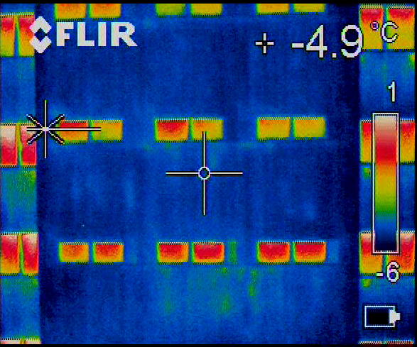
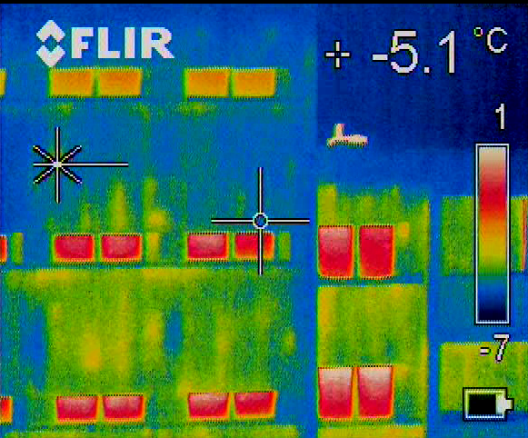
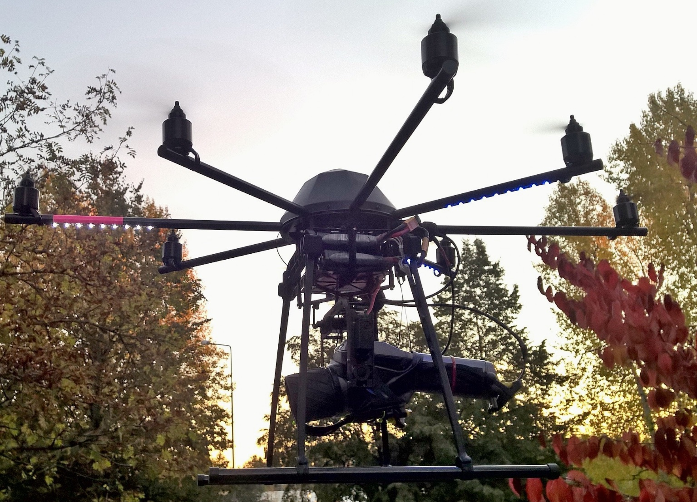
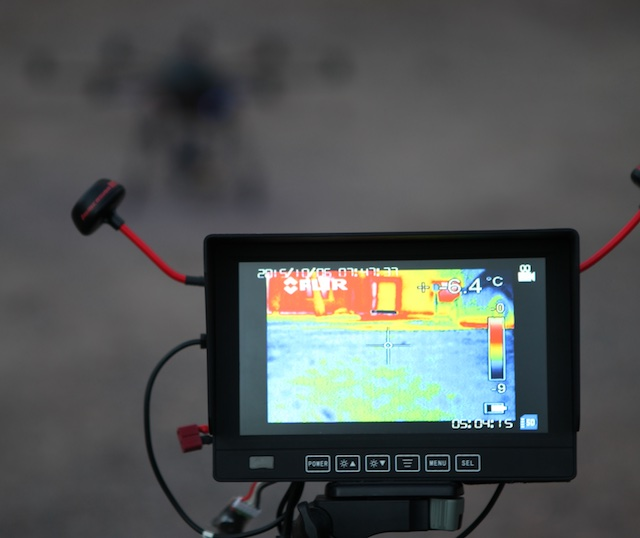

# Thermal Imaging

The emphasis of this text is on thermal imaging of buildings. Thermal camera shows the surface temperature of the object. The emissivity of the object affects greatly to the measured temperature. Typically matt surface objects (timber, concrete etc.) have emissivity around 0.95 which means that they absorb and emit 95% of the inbound heat radiation.  Uneven or coarse surface or just dust on the surface will have an effect on the emissivity value. The shiny metal surface is opposite of matt surface in regards of emissivity. Shiny objects usually have emissivity around 0.05, so they act like a mirror to thermal radiation and rather reflect temperature of the surrounding objects than their own. This means that they show in thermal image false temperature. Concave surfaces with moderate emissivity values can be problematic because the surface radiates to itself resulting higher temperature value on thermal image. So be wary with those shiny and/or concave objects.

The surface temperature of an object is affected by thermal conductivity. If we consider outer wall of the building, the increase in moisture content or moisture damage will alter thermal conductivity of the wall materials, and thus overall thermal conductivity. The thermal insulation layer of the wall contributes most to the thermal conductivity and is also most affected by moisture increase or moisture damage. **The change in the surface temperature of the buildings outer wall detected with thermal camera is most likely caused by moisture increase or moisture damage on the thermal insulation layer**.
Below are some example thermal images presented.

*Thermal image, normal looking wall, no major damages. Image taken before sunrise, no external heat sources present.*

*Thermal image, possibly wet thermal insulation on bottom floors. Image taken before sunrise, no external heat sources present.*

At this point a reader might question that they thought that thermal camera is used for finding air leakage on the building outer structures. Usually air leakage is consequence of structural movement caused by excess moisture in the structures. So we are back on the moisture related problem. Of course on new or under 2 year old buildings there is air leakage caused by construction phase and settling of the structures. The most problems in buildings occurs during rest of the life cycle. To the writer locating and detecting moisture damage without demolition of structures (possibly in vain) is of special interest.

Successfull thermal imaging requires temperature difference over object. This sets restrictions on when thermal imaging can be perfomed.

But for example after a cold night outer structures of the building are cooled and possible damages are more easily to be found. In principle from inside of the building damages are seen as cooler areas and from outside warmer areas.

Thermal imaging can be perfomed from the inside or the outside of the building. Problem with the outside imaging is that usually you have too deep angle of view to the building wall and reflecting thermal radiation from sky alters the result. Also some materials exhibit change in the emissivity value with the angle of view. This is one reason that in some literature it is recommended that thermal imaging should be done from the inside of the building. But we already have technology to aid us to do thermal imaging from outside of the building with field of view perpendicular to the target area. This is done with unmanned aerial systems (UAV, RPAS, Unmanned Aerial Vehicle, Remotely Piloted Aerial System).

*Thermal imaging with unmanned aerial system*

The data is recorded locally on UAV and streamed for monitoring purposed to the ground station.

*The live data streaming to ground station*

See [Aerial Thermography video on Vimeo](https://vimeo.com/149117940) for procedures involved in thermal imaging from unmanned aerial system.

# Categories

Categorizing thermal images based on the damage type

Images taken with thermal camera can show different patterns of heat distribution and different type of damages can be categorized. This repo will be used to gather basic types of the damage cases with short desciption of the cause and solution to the problem in question.
